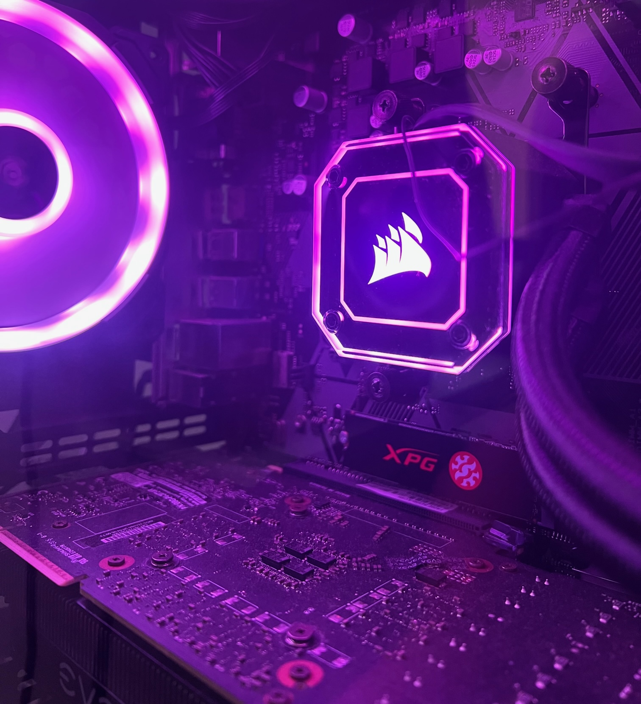

## Where Did It All Begin?

My interest in software engineering began with my love of video games. Growing up I have always had a passion for computers, electronics, and games. Throughout my college career, I have been through many different paths and learning experiences. When I first started my journey I gravitated toward natural sciences and earned a degree in Biology from the University of Hawaii at Manoa. Growing up on the islands of Hawaii I found myself surrounded by nature and was interested in pursuing something in the field of research or healthcare.   

## A Different Path

However, there was another field that I was always interested in but did not think of it as a career path until recently. Growing up I have been fascinated and engaged with computers and technology. Building computers, programming, and helping people with their technological problems has always been a passion of mine. After taking classes at Kapiolani Community College and eventually transferring to UH Manoa for computer science I have found myself on that path that I have been interested in. Through my classes, I have developed skills for programming and a new passion for the computer world. 

## Going Back To School

Looking towards the future, I hope to continue developing my skills in computer science by learning JavaScript this semester and hopefully learning Python in the future. With the skills that I have learned in javascript, I want to build a professional website using Meteor and other frameworks. I also want to become more familiar with video game development software such as Unreal Engine and Unity. I will be graduating from the University of Hawaii at Manoa in the spring of 2024 with a B.S. in Computer Science. I want to use the skills that I have developed through projects and in class to fulfill a rewarding career. 
