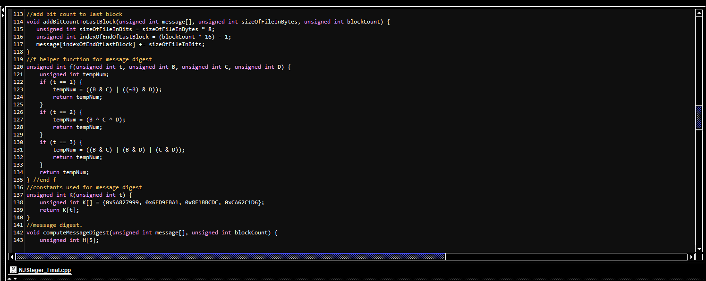

Cryptography secures communication by creating protocols preventing people from accessing private information. SHA-1 (Secure Hash Algorithm 1) is a hash function that takes input and produces a message digest. Hash functions map data of different sizes to a fixed value. Hash functions take a key as an input and use it for data storage and retrieval.  

I was the lead designer for this project in replicating a simple SHA-1 hash function using C++. I did this project through ICS 212 at Kapiolani community college. jGRASP was the main framework used in this project. However, I decided to expand my frameworks for this class used JetBrains’ CLion. This was the first time I had used a framework outside of jGRASP, and it significantly improved my programming experience. Understanding different languages and their uses have helped me become a better programmer. This was also my first experience with cryptography. Data confidentiality is vital to understand when moving into the future of programming and skill development.   

You can visit my project at [GitHub](https://github.com/Nicsteg/SHA-1-project).

References at [Wiki](https://en.wikipedia.org/wiki/SHA-1).
