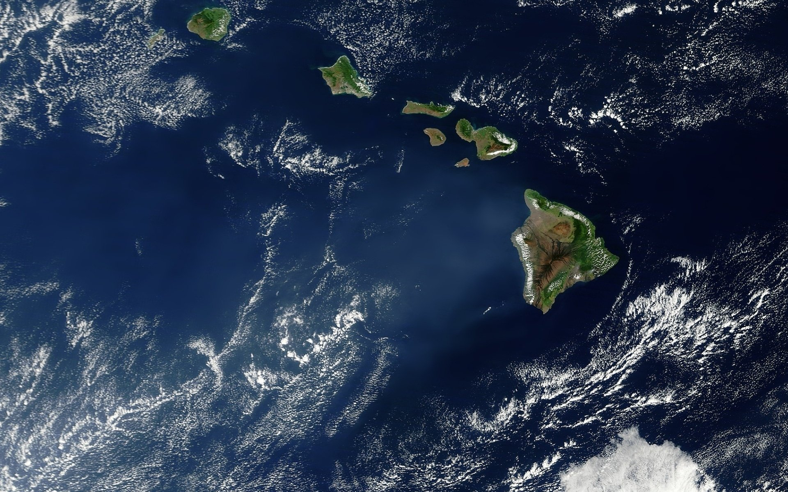

My aspiration to be a biologist and work in the medical field has been shaped strongly by my parents. My father received his Ph.D. in Zoology from UC Berkeley and has worked as a teacher and research biologist all of his life. My mother, who is also a teacher, has worked with him around the world on many research projects. I grew up with stories about their work. I have seen the contribution that their research has made to understanding the world we live in. Currently, there is a serious shortage of medical services in Hawaii. For example, my father recently developed a cataract in his right eye. He has had to wait for over two months just for an appointment to see a specialist about his condition. After that, who knows how long he will have to wait for the actual surgery. My academic goals going into college were to either do research or become a healthcare professional after graduation. 

Though this may not be a standard project I consider it to be an achievement in life. I have earned my degree in biology from the University of Hawaii at Manoa. I graduated with Sophomore Honors with a GPA of 3.77 magna cum laude.  This has given me the opportunity in life to forward this goal.  It is obvious that I could make a major contribution to my community as a medical professional by improving access to medical services throughout the islands.

