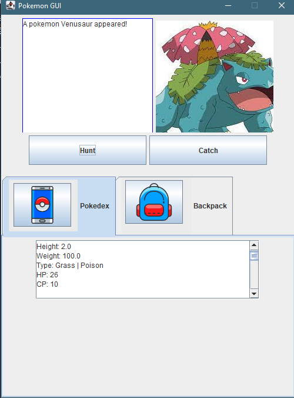
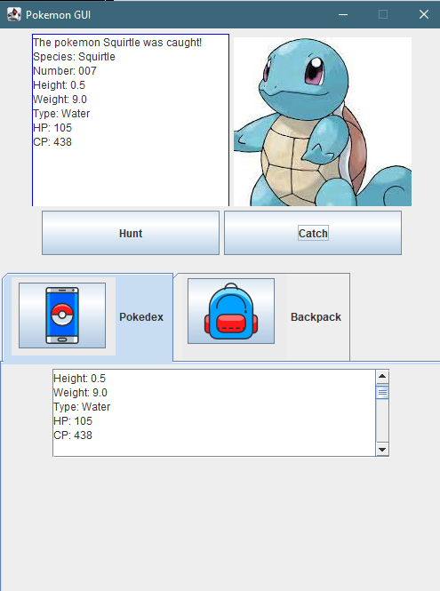
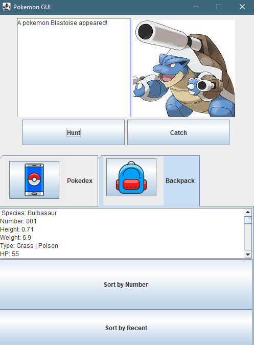

  
  
  

PokeGUI is a Graphical User Interface (GUI) of a Pokemon species hierarchy that was developed in Java. This project used object-oriented programming to create a hierarchical system for basic Pokemon such as Squirtle, Wartortle, and Blastoise. These Pokemon species families were then used as the basis of a simple game to catch and store pokemon in a binary search tree. The binary search tree was an essential representation of a Pokedex in which different Pokemon were kept throughout the game. Storing Pokemon was done by filling a stack and priority queue. Other buttons such as hunt, catch, Pokedex, and backpack were used for the GUI. 

For this project, my partner split the work between developing the Pokemon objects and creating a working game GUI. This was a class project for ICS 211 at Kapiolani Community College. For this project, we primarily used jGRASP for our framework. The main challenge in this project was using jGRASP to create different panels and listeners to create a coherent game. Coming from jGRASP and using other frameworks, such as IntelliJ, has given me a great appreciation for the power of new tools. As I continue my coding journey, I plan to program and develop new working games like the one in this class and at home. 

You can visit my project at [GitHub](https://github.com/ICSatKCC/a9-pokegui-s21-group-4-1.git).
