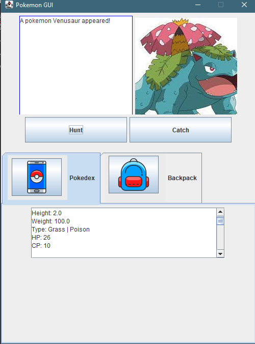

  
  
  

Snack Squad is a website that was created in my ICS 314 software engineering class. This website uses Bootstrap-React alongside Meteor to develop a website that the University of Hawaii community can use to filter, favorite, and consolidate eating options around campus. Meteor is an open-source, full-stack JavaScript platform for creating web applications. Bootstrap is a CSS framework that was used to create visually appealing user interfaces. 

Overall, Snack Squad is a great example of how technology can make everyday life easier. Providing a space for students and faculty to find and discover new eating options. This allows for more connectivity and engagement in campus culture and life. Overall, this has helped me understand web development as well as JavaScript. This has given me an appreciation for the different frameworks and tools that I hope to use one day for building websites and developing new applications.

You can visit my project at [GitHub](https://snack-squad.github.io/).
